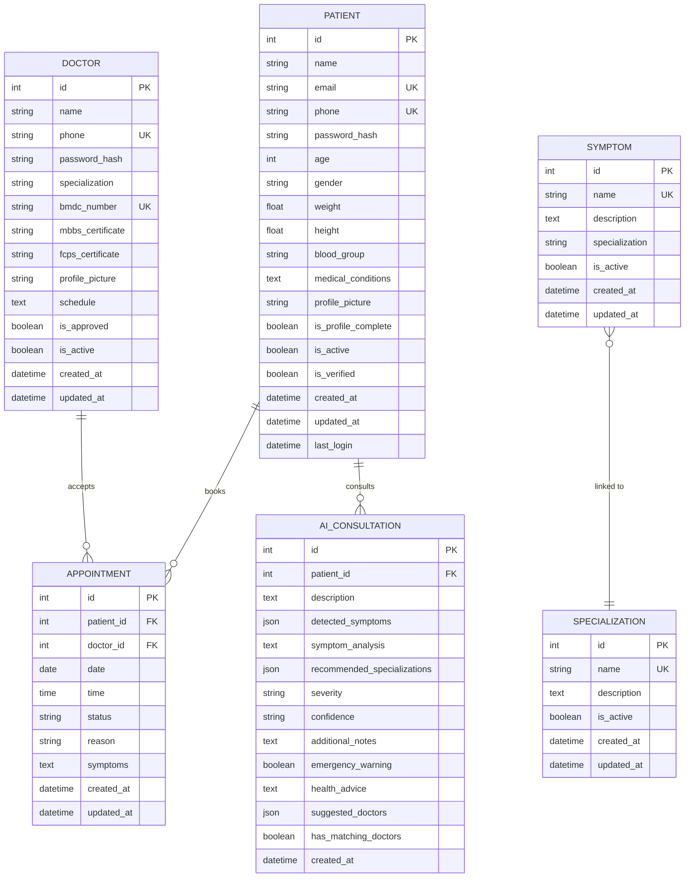

# MedNexus Database Schema - UML Diagram

## Entity Relationship Diagram



---

## Detailed Entity Descriptions

### 1. **PATIENT**
**Purpose**: Stores patient user accounts and health profiles

**Key Features**:
- Dual-phase registration (sign-up → profile completion)
- Health metrics (age, gender, weight, height, blood group)
- Medical history tracking
- Profile completion status tracking
- Email and phone uniqueness constraints

**Relationships**:
- One patient can book many appointments
- One patient can have many AI consultations

---

### 2. **DOCTOR**
**Purpose**: Stores verified healthcare provider accounts

**Key Features**:
- Medical credentials (BMDC number, MBBS, FCPS certificates)
- Specialization tracking
- Admin approval workflow (is_approved flag)
- Schedule management (JSON-encoded)
- Document storage (certificates, profile picture)

**Relationships**:
- One doctor can accept many appointments

**Validation Requirements**:
- BMDC number must be unique
- Phone number must be unique
- Must upload MBBS certificate (required)
- FCPS certificate is optional
- Requires admin approval before activation

---

### 3. **APPOINTMENT**
**Purpose**: Manages scheduling between patients and doctors

**Key Features**:
- Date and time slot booking
- Status tracking (Pending, Confirmed, Completed, Cancelled)
- Reason and symptoms documentation
- Audit trail with timestamps

**Relationships**:
- Many-to-one with PATIENT (patient_id FK)
- Many-to-one with DOCTOR (doctor_id FK)

**Status Values**:
- Pending: Initial booking state
- Confirmed: Doctor accepted
- Completed: Consultation finished
- Cancelled: Appointment cancelled

---

### 4. **AI_CONSULTATION**
**Purpose**: Stores AI-powered health consultation history

**Key Features**:
- Patient symptom description analysis
- ML-based symptom detection (JSON array)
- Specialization recommendations (JSON array)
- Severity and confidence levels
- Emergency warning system
- Doctor suggestions with matching algorithm
- Health advice generation

**Relationships**:
- Many-to-one with PATIENT (patient_id FK)
- Cascade delete when patient is removed

**JSON Fields**:
- `detected_symptoms`: Array of symptom objects
- `recommended_specializations`: Array of specialization matches
- `suggested_doctors`: Array of recommended doctor profiles

**Severity Levels**: low, moderate, high
**Confidence Levels**: low, medium, high

---

### 5. **SYMPTOM**
**Purpose**: Master data for symptom catalog

**Key Features**:
- Symptom name and description
- Linked to specialization (for routing)
- Active/inactive flag for data management
- Audit timestamps

**Relationships**:
- Many-to-one with SPECIALIZATION (via specialization name string)

**Usage**:
- Used by AI service for symptom detection
- Maps symptoms to appropriate medical specializations
- Helps in doctor recommendation engine

---

### 6. **SPECIALIZATION**
**Purpose**: Master data for medical specializations

**Key Features**:
- Specialization name and description
- Active/inactive flag
- Audit timestamps

**Relationships**:
- One-to-many with SYMPTOM (symptoms link to specializations)
- Referenced by DOCTOR.specialization (string field)

**Examples**:
- Cardiology
- Neurology
- Orthopedics
- Dermatology
- Pediatrics
- etc.

---

## Database Constraints

### Primary Keys
- All tables use auto-incrementing integer IDs

### Unique Constraints
- PATIENT: email, phone
- DOCTOR: phone, bmdc_number
- SYMPTOM: name
- SPECIALIZATION: name

### Foreign Keys
- APPOINTMENT → PATIENT (patient_id)
- APPOINTMENT → DOCTOR (doctor_id)
- AI_CONSULTATION → PATIENT (patient_id with CASCADE DELETE)

### Indexes
- All PKs are automatically indexed
- Unique fields are indexed
- Foreign keys are indexed

---

## Data Types Reference

| Type | Usage |
|------|-------|
| `Integer` | IDs, age, counters |
| `String(n)` | Short text fields (name, email, phone, etc.) |
| `Text` | Long text (descriptions, medical conditions, advice) |
| `Float` | Weight, height measurements |
| `Boolean` | Flags (is_active, is_approved, is_verified, etc.) |
| `Date` | Appointment dates |
| `Time` | Appointment time slots |
| `DateTime` | Timestamps (created_at, updated_at, expires_at) |
| `JSON` | Complex data (symptoms, recommendations, schedules) |

---

## Authentication & Security Architecture

### Token System
1. **Access Token** (JWT):
   - Lifetime: 60 minutes
   - Stored in: Frontend memory/localStorage
   - Used for: API request authorization

2. **Refresh Token** (DB-backed):
   - Lifetime: 30 days
   - Stored in: REFRESH_TOKEN table + frontend localStorage
   - Used for: Obtaining new access tokens without re-login

### User Types
- **Patient**: Regular users seeking healthcare
- **Doctor**: Healthcare providers (require admin approval)

### Security Features
- Password hashing (bcrypt)
- Token-based authentication (JWT)
- Session management

---

## Workflow Diagrams

### Patient Registration Flow
```
1. Sign Up (Basic Info)
   ↓
2. Create PATIENT record (is_profile_complete = false)
   ↓
3. Issue Access + Refresh Tokens
   ↓
4. Complete Profile (Health Details)
   ↓
5. Update PATIENT (is_profile_complete = true)
```

### Doctor Registration Flow
```
1. Sign Up (with Documents)
   ↓
2. Create DOCTOR record (is_approved = false)
   ↓
3. Admin Review
   ↓
4. Approval (is_approved = true)
   ↓
5. Doctor Can Accept Appointments
```

### Appointment Booking Flow
```
1. Patient searches doctors by specialization
   ↓
2. Patient selects doctor + date/time
   ↓
3. Create APPOINTMENT (status = Pending)
   ↓
4. Doctor reviews and confirms
   ↓
5. Update APPOINTMENT (status = Confirmed)
```

### AI Consultation Flow
```
1. Patient describes symptoms
   ↓
2. AI analyzes description
   ↓
3. Detect symptoms (JSON array)
   ↓
4. Recommend specializations
   ↓
5. Suggest matching doctors
   ↓
6. Create AI_CONSULTATION record
   ↓
7. Return recommendations to patient
```

---

## Schema Evolution Notes

### Version History
- **Initial Schema**: Core tables (Patient, Doctor, Appointment)
- **AI Features**: Added AI_CONSULTATION, SYMPTOM, SPECIALIZATION

### Future Considerations
- Add PRESCRIPTION table for doctor-patient prescriptions
- Add MEDICAL_RECORD table for patient health records
- Add PAYMENT table for billing integration
- Add NOTIFICATION table for real-time alerts
- Add REVIEW table for doctor ratings
- Add CHAT_MESSAGE table for in-app messaging
- Consider partitioning APPOINTMENT by date for performance

---

## Performance Optimization

### Current Indexes
- Primary keys (all tables)
- Unique constraints (email, phone, token, names)
- Foreign keys (patient_id, doctor_id)

### Query Optimization Tips
1. Use `patient_id` index for filtering AI consultations
2. Use `doctor_id` and `date` for appointment queries
3. Consider composite index on (patient_id, created_at) for consultation history

### Scaling Considerations
- APPOINTMENT table will grow large → consider archiving old records
- AI_CONSULTATION history → implement pagination
- Consider read replicas for doctor search queries

---

## Data Integrity Rules

1. **Cascade Deletes**:
   - When PATIENT is deleted → All AI_CONSULTATION records are deleted

2. **Soft Deletes** (using is_active flag):
   - PATIENT: is_active = False
   - DOCTOR: is_active = False
   - SYMPTOM: is_active = False
   - SPECIALIZATION: is_active = False

3. **Approval Workflow**:
   - DOCTOR.is_approved must be True before accepting appointments

4. **Profile Completion**:
   - PATIENT.is_profile_complete should be True before booking appointments

---

## Technology Stack

- **ORM**: SQLAlchemy
- **Database**: PostgreSQL (Neon)
- **Migrations**: Alembic
- **Authentication**: JWT (jose library)
- **Password Hashing**: bcrypt
- **API Framework**: FastAPI
- **Date/Time**: Python datetime with timezone support

---

*Generated: January 26, 2026*
*Database Schema Version: 1.2*
